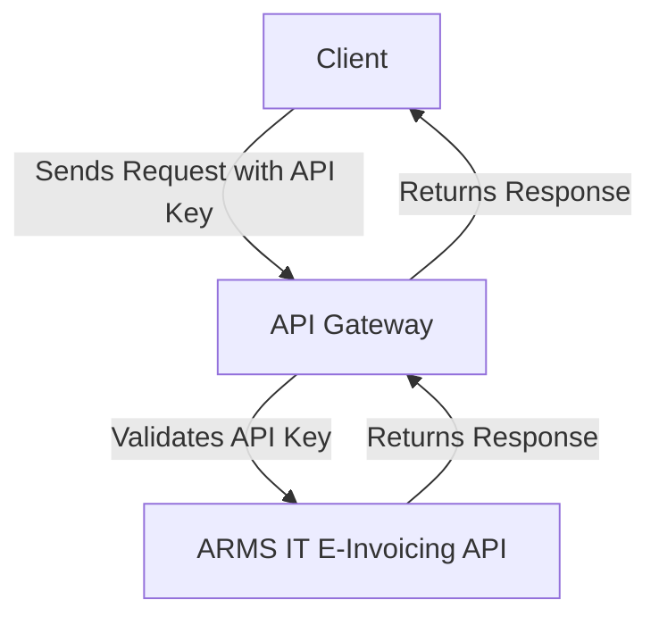
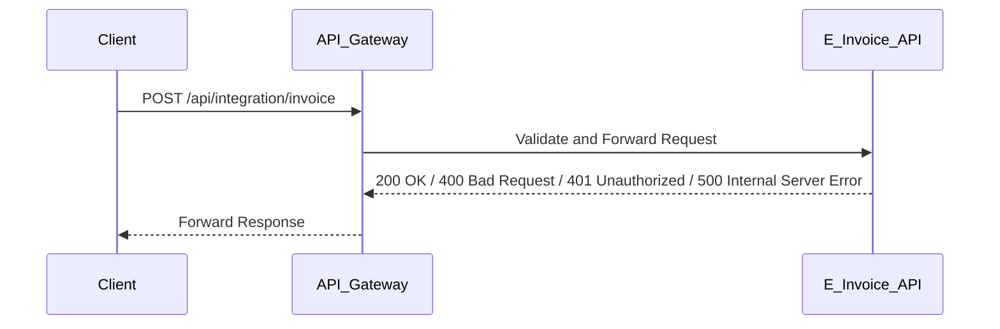

# ARMS IT E-Invoicing Integration API Documentation

## Base URL
All requests should be made to the following base URL:
```
https://einvoice-api.armsit.com
```

## Authentication
This API uses API key-based authentication. Each request must include the following headers:
- `X-API-KEY`: Your API key

Example header:
```
X-API-KEY: <YOUR_API_KEY>
```

## Endpoints

### Common Request Body
Most fields in the request bodies for creating tax invoices, tax debit notes, and tax credit notes are similar. Here is the common structure for the request body:

```json
{
  "ActualDeliveryDate": "2023-10-17T12:00:0022",
  "Confirmed": false,
  "CurrencyCode": "SAR",
  "DueDate": "2023-10-17T12:00:00",
  "customer": {
    "address": {
      "translations": [
        {
          "additionalNumber": "",
          "additionalStreet": "",
          "buildingNumber": "2539",
          "city": "MAKKAH",
          "countryCode": "SA",
          "locale": 1,
          "neighborhood": "MAKKAH",
          "postalCode": "24344",
          "state": "MAKKAH",
          "street": "الملك فهد"
        }
      ]
    },
    "identities": null,
    "translations": [
      {
        "locale": 1,
        "name": "English Customer name"
      }
    ],
    "type": 1,
    "vat": "310151544900003"
  },
  "products": [
    {
      "code": "1203104130_1004",
      "discountAmount": 0.0,
      "discountPercentage": 0.0,
      "taxCategories": [
        {
          "percent": 15.0,
          "taxCategoryCode": "S",
          "taxScheme": "VAT"
        }
      ],
      "keepNegative": false,
      "label": "Aggregate , 19 MM",
      "price": 10.000,
      "qty": 347.0,
      "serial": 1,
      "unitCode": "ton"
    },
    {
      "code": "1203104130_1002",
      "discountAmount": 0.0,
      "discountPercentage": 0.0,
      "taxCategories": [
        {
          "percent": 15.0,
          "taxCategoryCode": "S",
          "taxScheme": "VAT"
        }
      ],
      "keepNegative": false,
      "label": "Aggregate , 10 MM",
      "price": 12.000,
      "qty": 182.76,
      "serial": 2,
      "unitCode": "ton"
    },
    {
      "code": "1203104130_1003",
      "discountAmount": 0.0,
      "discountPercentage": 0.0,
      "taxCategories": [
        {
          "percent": 15.0,
          "taxCategoryCode": "S",
          "taxScheme": "VAT"
        }
      ],
      "keepNegative": false,
      "label": "Aggregate , 14 MM",
      "price": 11.000,
      "qty": 197.0,
      "serial": 2,
      "unitCode": "ton"
    }
  ],
  "properties": [
    {
      "translations": [
        {
          "locale": 1,
          "name": "Customer Reference"
        }
      ],
      "index": 1,
      "key": "CustomerReference",
      "showOnPdf": true,
      "value": "21/09/2023"
    },
    {
      "translations": [
        {
          "locale": 1,
          "name": "Invoice Reference Number"
        }
      ],
      "index": 2,
      "key": "InvoiceReferenceNumber",
      "showOnPdf": true,
      "value": ""
    },
    {
      "translations": [
        {
          "locale": 1,
          "name": "Sales Order"
        }
      ],
      "index": 3,
      "key": "SalesOrder",
      "showOnPdf": true,
      "value": "5035-2-008993"
    },
    {
      "translations": [
        {
          "locale": 1,
          "name": "Project Name"
        }
      ],
      "index": 4,
      "key": "ProjectName",
      "showOnPdf": true,
      "value": ""
    },
    {
      "translations": [
        {
          "locale": 1,
          "name": "Invoice Account"
        }
      ],
      "index": 5,
      "key": "InvoiceAccount",
      "showOnPdf": true,
      "value": "100146"
    }
  ],
  "vendor": {
    "address": {
      "translations": [
        {
          "additionalNumber": "",
          "additionalStreet": "",
          "buildingNumber": "4727",
          "city": "Riyadh",
          "countryCode": "SA",
          "locale": 1,
          "neighborhood": "Riyadh",
          "postalCode": "11412",
          "state": "Riyadh",
          "street": "Thumama Street"
        }
      ]
    },
    "Translations": [
      {
        "locale": 1,
        "name": "Demo Company Inc."
      }
    ],
    "invoiceFooter": "",
    "vat": "<VAT NUMBER>"
  },
  "exportsInvoiceTransaction": false,
  "includePrepaid": false,
  "includePrepaidInTax": false,
  "includeRetention": false,
  "includeRetentionInTax": false,
  "InvoiceIssueDate": "2023-09-24T12:00:00",
  "InvoiceNote": "5025-1-010234",
  "LatestDeliveryDate": "2023-10-18T12:00:00",
  "NominalInvoiceTransaction": true,
  "OrderReferenceId": "Purchase order or similar id",
  "OriginalInvoiceNumber": "5025-1-010234",
  "PaymentMeansCode": 10,
  "PaymentNote": "Payment Note",
  "PaymentType": "b2b",
  "PrepaidAmount": 0.0,
  "prepaidTax": 0.0,
  "PushToZatcaSynchronously": true,
  "retention": 0.0,
  "retentionTax": 0.0,
  "summaryInvoiceTransaction": false,
  "TransactionType": "nominal"
}
```

### Tax Invoice Specific Fields
In addition to the common request body fields, the following field is specific to tax invoices:

- `Type`: `"tax"`
- `InvoiceTypeCode`: `388`

### Tax Debit Note Specific Fields
In addition to the common request body fields, the following fields are specific to tax debit notes:

- `Type`: `"tax-debit-note"`
- `InvoiceTypeCode`: `383`
- `BillingReferenceId`: `"Changed invoice number"`
- `InstructionNote`: `"3"`

### Tax Credit Note Specific Fields
In addition to the common request body fields, the following fields are specific to tax credit notes:

- `Type`: `"tax-credit-note"`
- `InvoiceTypeCode`: `381`
- `BillingReferenceId`: `"Changed invoice number"`
- `InstructionNote`: `"1"`

### Example Requests

#### Create Tax Invoice

**Endpoint:** `/api/integration/invoice`  
**Method:** `POST`  
**Request Body:**
```json
{
  // Common request body fields here
  "Type": "tax",
  "InvoiceTypeCode": 388
}
```

#### Create Tax Debit Note

**Endpoint:** `/api/integration/invoice`  
**Method:** `POST`  
**Request Body:**
```json
{
  // Common request body fields here
  "Type": "tax-debit-note",
  "InvoiceTypeCode": 383,
  "BillingReferenceId": "Changed invoice number",
  "InstructionNote": "3"
}
```

#### Create Tax Credit Note

**Endpoint:** `/api/integration/invoice`  
**Method:** `POST`  
**Request Body:**
```json
{
  // Common request body fields here
  "Type": "tax-credit-note",
  "InvoiceTypeCode": 381,
  "BillingReferenceId": "Changed invoice number",
  "InstructionNote": "1"
}
```

## Error Codes
- `200 OK`: Request was successful.
- `400 Bad Request`: The request could not be understood or was missing required parameters.
- `401 Unauthorized`: Authentication failed or user does not have permissions for the requested operation.
- `500 Internal Server Error`: An error occurred on the server.

## Diagrams

### Authentication Flow


### Invoice Creation Flow

